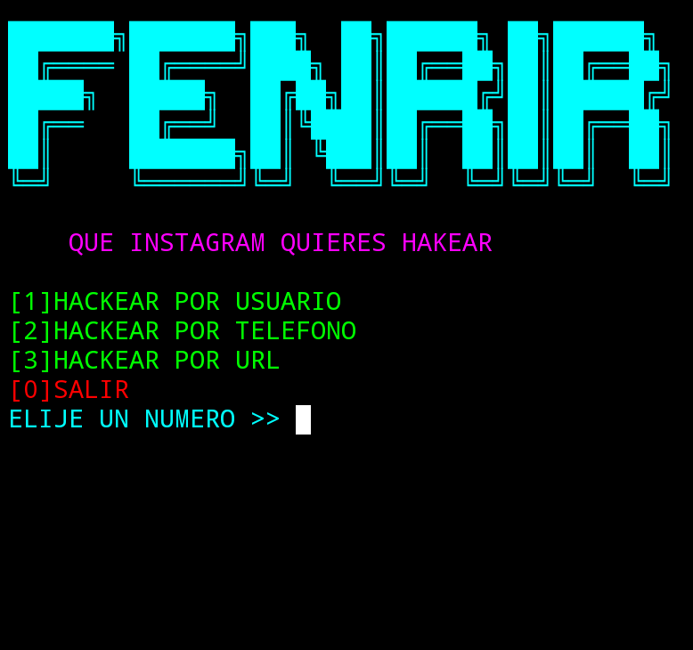

* Herramienta sencilla de hackeo
# instalacion
* apt update && apt upgrade -y
* apt install python
* apt install git -y
* termux-setup-storage
* git clone https://github.com/Fenrir-00/instagramhack
* cd instagramhack
* chmod +x instagram.py
* python3 instagram.py
# si tienes algun error escribeme al telegram @Ritorito1990
#
